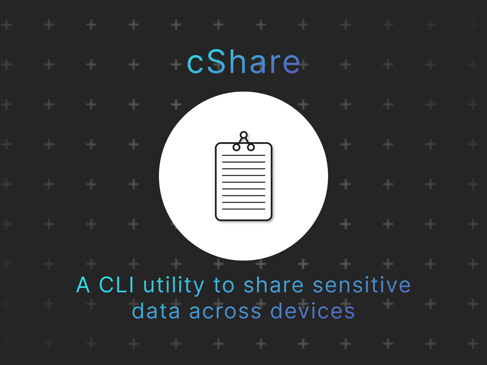

## Table Of Content

- [Table Of Content](#table-of-content)
- [Overview](#overview)
- [Status](#status)
- [Digrams](#digrams)
  - [Database ER Digram](#database-er-digram)
- [Usage](#usage)
  - [Starting the Server](#starting-the-server)
  - [System Prerequisite](#system-prerequisite)
  - [Running Locally](#running-locally)
    - [Running database container](#running-database-container)
    - [Running Go Code](#running-go-code)
- [API Document](#api-document)
- [Contribution](#contribution)
- [Acknowledgement](#acknowledgement)
- [License](#license)

## Overview

cShare is a command-line utility built in Golang to send sensitive text data across devices. This repository is the backend server of cShare.

The back end is featured with

- **RESTful API** for communication.
- User **authentication** and **authorization**
- Secured resource endpoints using **JSON Web Tokens (JWT)**
- **Single-file** binary.
- **Containerized** environment for portability and scalability.
- **API documentation** using [Postman](https://www.postman.com/)

Technologies used

- [Go](https://go.dev/) is the primary backend code.
- [PostgresSQL](https://www.postgresql.org/) is the primary database for storing user authentication details, user data, and clip data.
- [Docker](https://www.docker.com/) for containerizing and packaging software.

Framework used

- [Gin](https://github.com/gin-gonic/gin) framework is the primary tool for building RESTful APIs.
- [cypherDecipher](https://github.com/jammutkarsh/cypherDecipher) for password salting and un-salting.

## Status

> The backend (this project) is at stable version v1. It provides basic API endpoints for daily use.
> The official frontend command-line application is currently in development.
> You can also build your custom frontend(GUI, CLI or TUI) on top of this backend by following the docuementations.

## Digrams

### Database ER Digram

Refer ER digrams [here](doc/schema/README.md)

## Usage

Before you ping the endpoints, Follow the steps to setup the inital configuration of the application.

### Starting the Server

1. Clone the repository [JammUtkarsh/cshare-server](https://github.com/JammUtkarsh/cshare-server)

```bash
git clone https://github.com/JammUtkarsh/cshare-server
```

2. Change directory to `cshare-server`

```bash
cd cshare-server
```

3. Generate the .env file. It contains preferences depending upon **development/debug** or **deployment/production**. `.env.local` has default preferences for production.

```bash
cp .env.local .env 
```

### System Prerequisite

- [Docker](https://www.docker.com/)
- [Go](https://go.dev/)
- [Postman](https://www.postman.com/)
- [PostgresSQL](https://www.postgresql.org/) (optional)

**NOTE: The entire application was developed only using Go and Docker installed in the system. PostgreSQL databases were running in Docker containers.**

### Running Locally

#### Running database container

**A.** Using `docker-compose`

 ```bash
sudo docker compose up --build
 ```

**B.** Using pre-built image

```bash
# running databse with preconfigured tables.
docker volume create pgdata
docker pull jammutkarsh/cshare-db

docker run --rm -p 5432:5432 -v pgdata:/var/lib/postgresql/data jammutkarsh/cshare-db
# or

# OR

# building and running the container..
docker build -t cshare-db --target=database .

docker run --rm -p 5432:5432 -v pgdata:/var/lib/postgresql/data cshare-db
```

#### Running Go Code

```bash
go run .
```

The server will be now be accessable on port `:5675` or as per the `.env` file

## API Document

See [Postman API Documentation](https://documenter.getpostman.com/view/19332599/2s8YszQqbU)

Use `Run In Postman` on *top right corner* for best experience.

## Contribution

This project is for learning purposes. Although you still can open issues if you find any.
If possible, mention minimum amount of steps to reproduce the issue in the [issue tab](https://github.com/JammUtkarsh/cshare-server/issues)

## Acknowledgement

I would like to give special thanks to the Go community, especially the [Discord Community](https://discord.gg/golang)

## License

cShare is [MIT Licensed](https://github.com/JammUtkarsh/cshare-server/blob/main/LICENSE.md)
