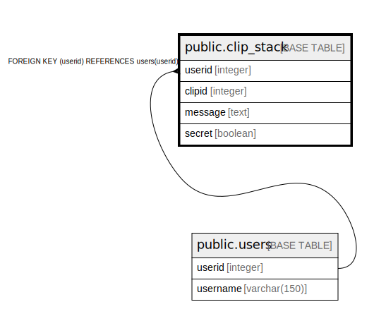

# public.clip_stack

## Description

## Columns

| Name | Type | Default | Nullable | Children | Parents | Comment |
| ---- | ---- | ------- | -------- | -------- | ------- | ------- |
| userid | integer |  | false |  | [public.users](public.users.md) |  |
| clipid | integer |  | false |  |  |  |
| message | text |  | false |  |  |  |
| secret | boolean |  | true |  |  |  |

## Constraints

| Name | Type | Definition |
| ---- | ---- | ---------- |
| userid | FOREIGN KEY | FOREIGN KEY (userid) REFERENCES users(userid) |
| clip_stack_pkey | PRIMARY KEY | PRIMARY KEY (userid, clipid) |

## Indexes

| Name | Definition |
| ---- | ---------- |
| clip_stack_pkey | CREATE UNIQUE INDEX clip_stack_pkey ON public.clip_stack USING btree (userid, clipid) |

## Relations

---

> Generated by [tbls](https://github.com/k1LoW/tbls)
