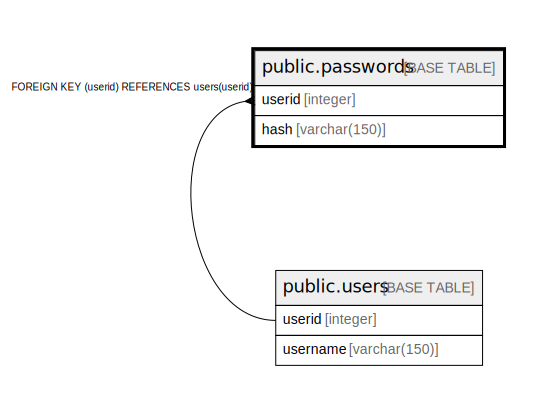

# public.passwords

## Description

## Columns

| Name | Type | Default | Nullable | Children | Parents | Comment |
| ---- | ---- | ------- | -------- | -------- | ------- | ------- |
| userid | integer |  | false |  | [public.users](public.users.md) |  |
| hash | varchar(150) |  | false |  |  |  |

## Constraints

| Name | Type | Definition |
| ---- | ---- | ---------- |
| userid | FOREIGN KEY | FOREIGN KEY (userid) REFERENCES users(userid) |
| passwords_pkey | PRIMARY KEY | PRIMARY KEY (userid) |

## Indexes

| Name | Definition |
| ---- | ---------- |
| passwords_pkey | CREATE UNIQUE INDEX passwords_pkey ON public.passwords USING btree (userid) |

## Relations

---

> Generated by [tbls](https://github.com/k1LoW/tbls)
