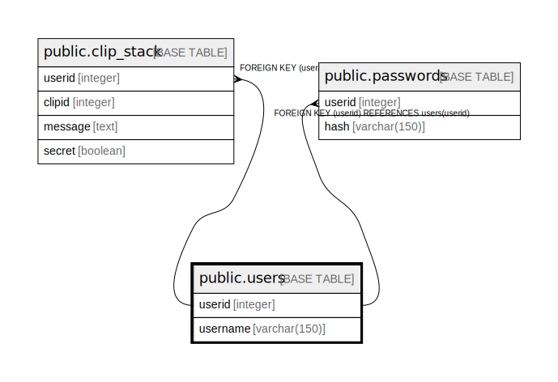

# public.users

## Description

## Columns

| Name | Type | Default | Nullable | Children | Parents | Comment |
| ---- | ---- | ------- | -------- | -------- | ------- | ------- |
| userid | integer |  | false | [public.clip_stack](public.clip_stack.md) [public.passwords](public.passwords.md) |  |  |
| username | varchar(150) |  | false |  |  |  |

## Constraints

| Name | Type | Definition |
| ---- | ---- | ---------- |
| users_pkey | PRIMARY KEY | PRIMARY KEY (userid) |
| users_username_key | UNIQUE | UNIQUE (username) |

## Indexes

| Name | Definition |
| ---- | ---------- |
| users_pkey | CREATE UNIQUE INDEX users_pkey ON public.users USING btree (userid) |
| users_username_key | CREATE UNIQUE INDEX users_username_key ON public.users USING btree (username) |

## Relations

---

> Generated by [tbls](https://github.com/k1LoW/tbls)
